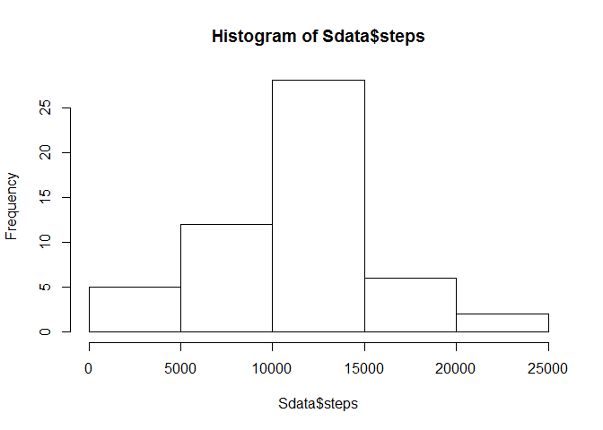
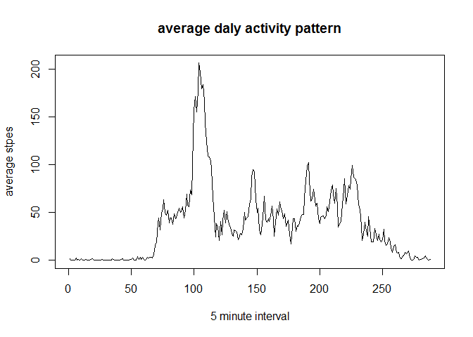
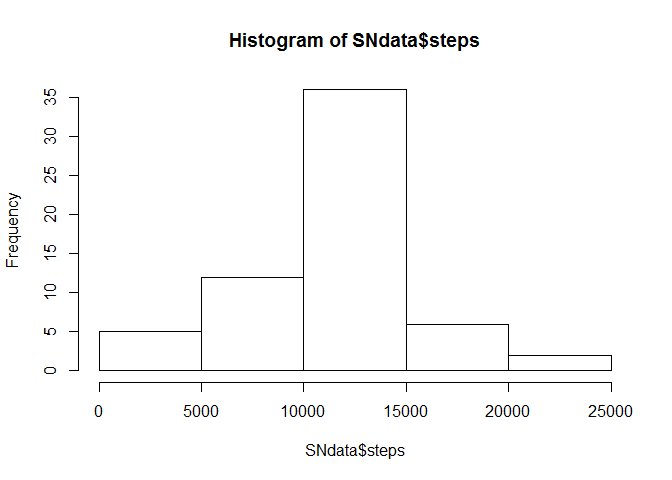
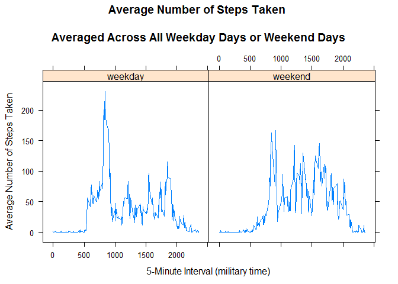

# Reproducible Research: Peer Assessment 1


## Loading and preprocessing the data

###read raw data after fork in github and git clone in Git bash

```r
RData <- unzip("C:/Users/Kati/RepData_PeerAssessment1/activity.zip")
RData<- read.csv("./activity.csv", header=TRUE)
```
## What is mean total number of steps taken per day?
1 Summarize steps by day and store in Sdate   
2 Create a histogram of the  sum steps per day   
3 Calculate the mean and the median of the total number of steps per day   

```r
Sdata<-aggregate(steps~date, data=RData, FUN="sum")
hist(Sdata$steps)
```

 

```r
mean(Sdata$steps)
```

```
## [1] 10766.19
```

```r
median(Sdata$steps)
```

```
## [1] 10765
```
## What is the average daily activity pattern?
1 Create data set for eveluating average daly activity pattern  
2 Plot the average daly activity pattern by creating time series plot  
3 Find the that 5-minutes interval which has a maximum number of steps on average acrass all days

```r
SDMData<-aggregate(steps~interval, data=RData,FUN="mean")
plot.ts(SDMData$steps, main="average daly activity pattern", ylab="average stpes", xlab="5 minute interval")
```

 

```r
which.max(SDMData$steps)
```

```
## [1] 104
```
## Imputing missing values
1 Calculate  the total number of missing values in the dataset  
2 Fill missing value with corresponding intervals mean value  
3 Summarize steps by day and store in SNdate for the filled data set  
4 Create a histogram of the  sum steps per day  
5 Calculate the mean and the median of the total number of steps per day  

```r
sum(is.na(RData[1]))
```

```
## [1] 2304
```

```r
library(dplyr)
```

```
## 
## Attaching package: 'dplyr'
## 
## The following object is masked from 'package:stats':
## 
##     filter
## 
## The following objects are masked from 'package:base':
## 
##     intersect, setdiff, setequal, union
```

```r
NData<-RData
sapply(unique(RData$interval), function(x)
  NData[!complete.cases(NData)&(NData$interval==x),1]<<-SDMData$steps[SDMData$interval==x])
```

```
##   [1]   1.7169811   0.3396226   0.1320755   0.1509434   0.0754717
##   [6]   2.0943396   0.5283019   0.8679245   0.0000000   1.4716981
##  [11]   0.3018868   0.1320755   0.3207547   0.6792453   0.1509434
##  [16]   0.3396226   0.0000000   1.1132075   1.8301887   0.1698113
##  [21]   0.1698113   0.3773585   0.2641509   0.0000000   0.0000000
##  [26]   0.0000000   1.1320755   0.0000000   0.0000000   0.1320755
##  [31]   0.0000000   0.2264151   0.0000000   0.0000000   1.5471698
##  [36]   0.9433962   0.0000000   0.0000000   0.0000000   0.0000000
##  [41]   0.2075472   0.6226415   1.6226415   0.5849057   0.4905660
##  [46]   0.0754717   0.0000000   0.0000000   1.1886792   0.9433962
##  [51]   2.5660377   0.0000000   0.3396226   0.3584906   4.1132075
##  [56]   0.6603774   3.4905660   0.8301887   3.1132075   1.1132075
##  [61]   0.0000000   1.5660377   3.0000000   2.2452830   3.3207547
##  [66]   2.9622642   2.0943396   6.0566038  16.0188679  18.3396226
##  [71]  39.4528302  44.4905660  31.4905660  49.2641509  53.7735849
##  [76]  63.4528302  49.9622642  47.0754717  52.1509434  39.3396226
##  [81]  44.0188679  44.1698113  37.3584906  49.0377358  43.8113208
##  [86]  44.3773585  50.5094340  54.5094340  49.9245283  50.9811321
##  [91]  55.6792453  44.3207547  52.2641509  69.5471698  57.8490566
##  [96]  56.1509434  73.3773585  68.2075472 129.4339623 157.5283019
## [101] 171.1509434 155.3962264 177.3018868 206.1698113 195.9245283
## [106] 179.5660377 183.3962264 167.0188679 143.4528302 124.0377358
## [111] 109.1132075 108.1132075 103.7169811  95.9622642  66.2075472
## [116]  45.2264151  24.7924528  38.7547170  34.9811321  21.0566038
## [121]  40.5660377  26.9811321  42.4150943  52.6603774  38.9245283
## [126]  50.7924528  44.2830189  37.4150943  34.6981132  28.3396226
## [131]  25.0943396  31.9433962  31.3584906  29.6792453  21.3207547
## [136]  25.5471698  28.3773585  26.4716981  33.4339623  49.9811321
## [141]  42.0377358  44.6037736  46.0377358  59.1886792  63.8679245
## [146]  87.6981132  94.8490566  92.7735849  63.3962264  50.1698113
## [151]  54.4716981  32.4150943  26.5283019  37.7358491  45.0566038
## [156]  67.2830189  42.3396226  39.8867925  43.2641509  40.9811321
## [161]  46.2452830  56.4339623  42.7547170  25.1320755  39.9622642
## [166]  53.5471698  47.3207547  60.8113208  55.7547170  51.9622642
## [171]  43.5849057  48.6981132  35.4716981  37.5471698  41.8490566
## [176]  27.5094340  17.1132075  26.0754717  43.6226415  43.7735849
## [181]  30.0188679  36.0754717  35.4905660  38.8490566  45.9622642
## [186]  47.7547170  48.1320755  65.3207547  82.9056604  98.6603774
## [191] 102.1132075  83.9622642  62.1320755  64.1320755  74.5471698
## [196]  63.1698113  56.9056604  59.7735849  43.8679245  38.5660377
## [201]  44.6603774  45.4528302  46.2075472  43.6792453  46.6226415
## [206]  56.3018868  50.7169811  61.2264151  72.7169811  78.9433962
## [211]  68.9433962  59.6603774  75.0943396  56.5094340  34.7735849
## [216]  37.4528302  40.6792453  58.0188679  74.6981132  85.3207547
## [221]  59.2641509  67.7735849  77.6981132  74.2452830  85.3396226
## [226]  99.4528302  86.5849057  85.6037736  84.8679245  77.8301887
## [231]  58.0377358  53.3584906  36.3207547  20.7169811  27.3962264
## [236]  40.0188679  30.2075472  25.5471698  45.6603774  33.5283019
## [241]  19.6226415  19.0188679  19.3396226  33.3396226  26.8113208
## [246]  21.1698113  27.3018868  21.3396226  19.5471698  21.3207547
## [251]  32.3018868  20.1509434  15.9433962  17.2264151  23.4528302
## [256]  19.2452830  12.4528302   8.0188679  14.6603774  16.3018868
## [261]   8.6792453   7.7924528   8.1320755   2.6226415   1.4528302
## [266]   3.6792453   4.8113208   8.5094340   7.0754717   8.6981132
## [271]   9.7547170   2.2075472   0.3207547   0.1132075   1.6037736
## [276]   4.6037736   3.3018868   2.8490566   0.0000000   0.8301887
## [281]   0.9622642   1.5849057   2.6037736   4.6981132   3.3018868
## [286]   0.6415094   0.2264151   1.0754717
```

```r
SNdata<-aggregate(steps~date, data=NData, FUN="sum")
hist(SNdata$steps)
```

 

```r
mean(SNdata$steps)
```

```
## [1] 10766.19
```

```r
median(SNdata$steps)
```

```
## [1] 10766.19
```


## Are there differences in activity patterns between weekdays and weekends?

1 Create a new factor variable in the dataset with two levels – “weekday”
and “weekend” indicating whether a given date is a weekday or weekend
day.  
2 Make a panel plot containing a time series plot (i.e. type = "l") of the
5-minute interval (x-axis) and the average number of steps taken, averaged
across all weekday days or weekend days (y-axis).  

```r
NData$date<-as.Date(NData$date,"%Y-%m-%d")
NData$weektime <- as.factor(ifelse(weekdays(NData$date) %in% 
                c("vasárnap","szombat"),"weekend", "weekday"))
SDMNData<-aggregate(steps~interval+weektime, data=NData,FUN="mean")
library("lattice")
p <- xyplot(steps ~ interval | factor(weektime), data=SDMNData, 
       type = 'l',
       main="Average Number of Steps Taken 
       \nAveraged Across All Weekday Days or Weekend Days",
       xlab="5-Minute Interval (military time)",
       ylab="Average Number of Steps Taken")
print (p) 
```

 
